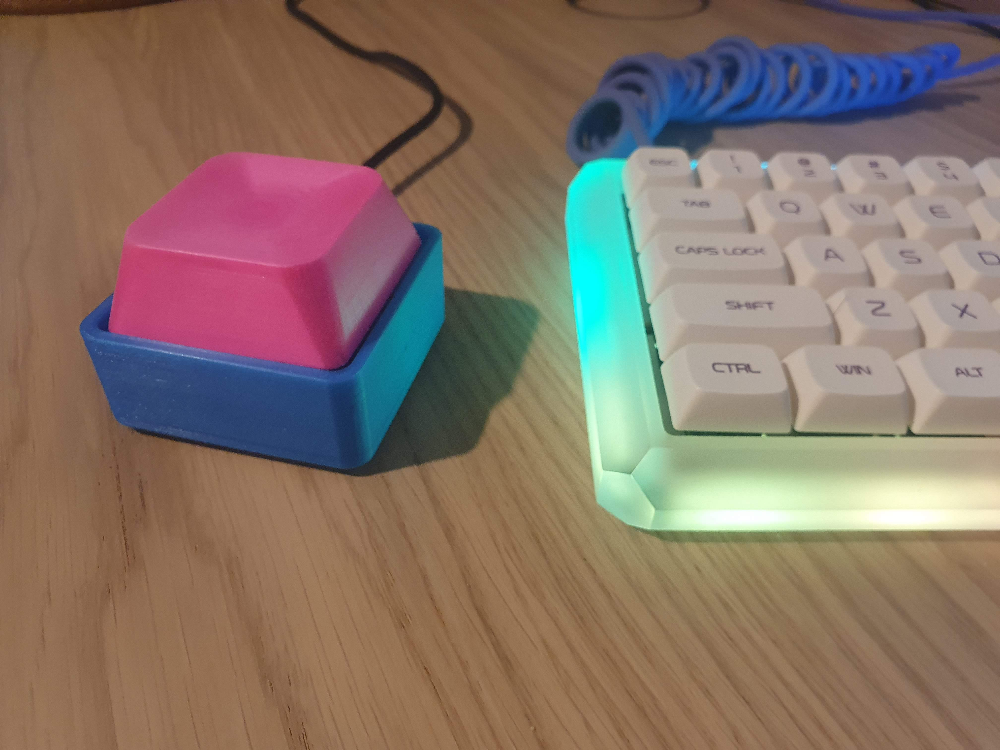
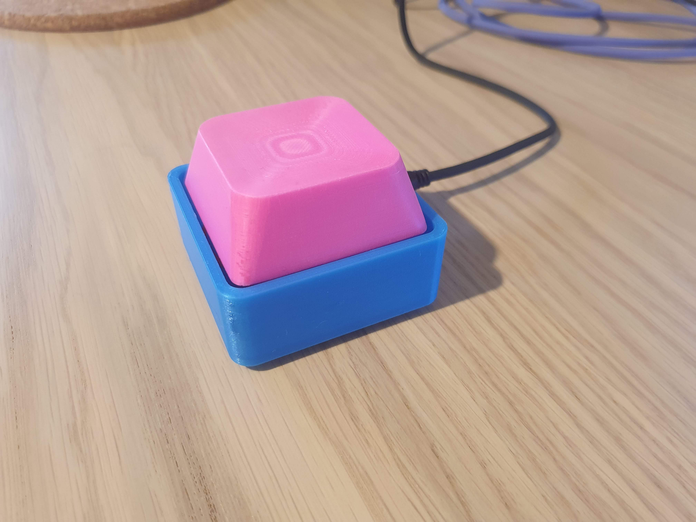
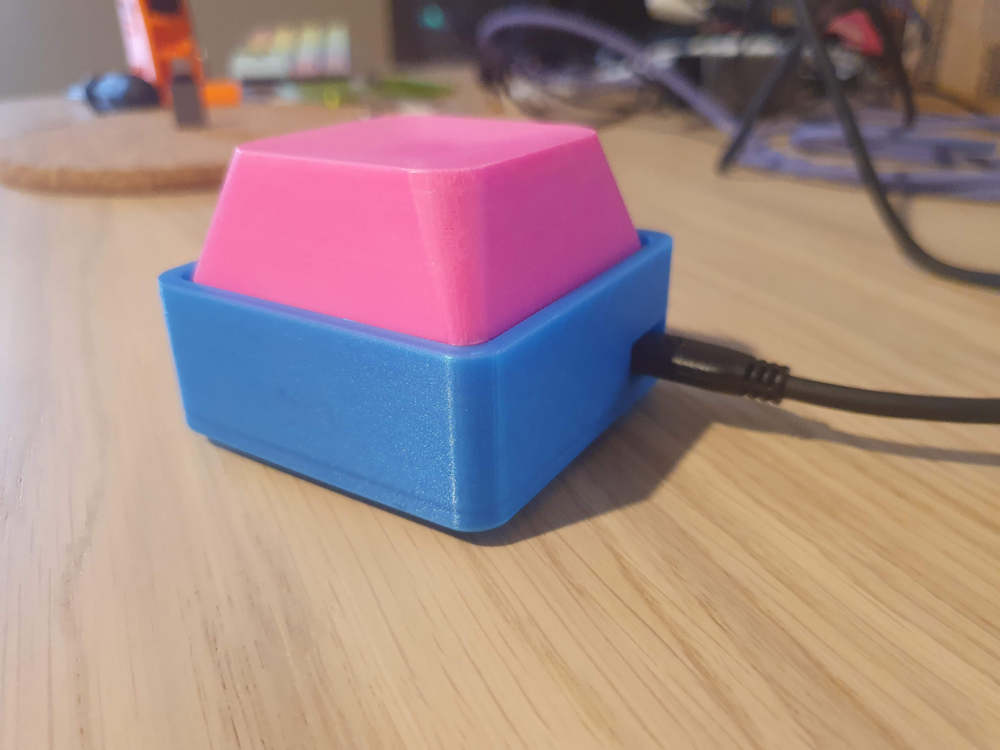
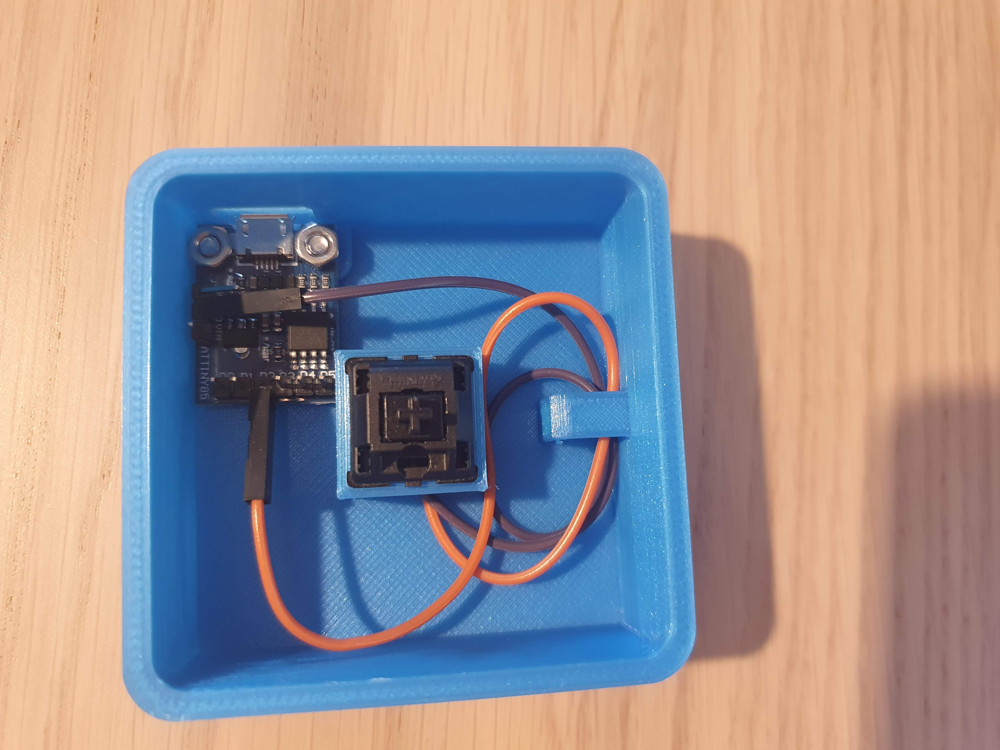
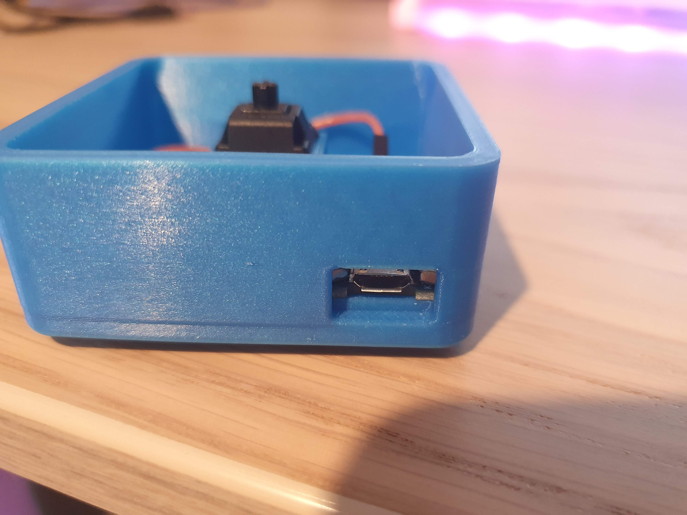
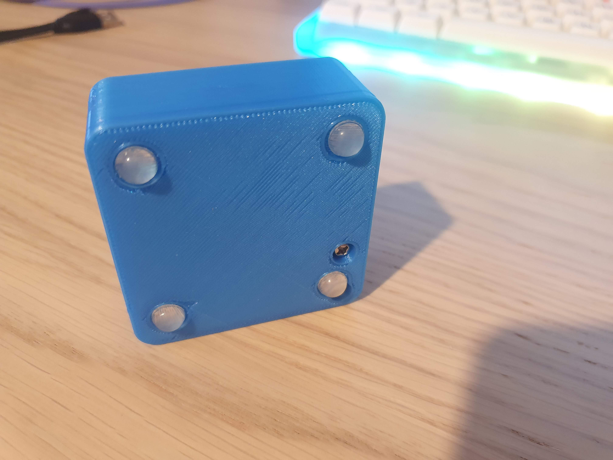

# Moderately-sized 3D printable USB macro key

- __Less than 5€ to make__
- __Works with any Cherry MX compatible switch__
- __59x59mm size__
- __Support for rubber feet__

  
  
  
  
  
  

## Bill of materials

- 1x Digispark attiny85 development board (micro USB version) (~2.5€ on aliexpress)
- 1x Cherry MX compatible switch (10 pieces for ~1€ on aliexpress)
- 2x jumper cables
- 2x M3 screws & nuts
- Optionally 4x rubber feet (<8mm in diameter)

## Tools

- Soldering iron or electrical tape to connect the jumper wires to the switch legs.
- Arduino IDE to program the board

## Assembly

### Printing

The macro key consists of two parts:

- the base - [stl](./macrokey_base.stl) | [step](./macrokey_base.step)
- the keycap - [stl](./macrokey_keycap.stl) | [step](./macrokey_keycap.step)

I printed the base with 0.1mm resolution with supports everywhere.
I printed the keycap with 0.07mm resolution with supports on the build plate. I also added a support blocker for the key cap stem since it's too small for the support to be printed inside and it tends to stick to the sides of the stem on my printer. The keycap should be printed with the highest resolution you can afford to make sure that the stem is printed correctly.

### Putting it together

_Scroll down for a [schematic](#schematic)._

Once the base piece is printed, attach the attiny85 with a pair of M3 screws. Then, attach two jumper cables to the legs of the switch. I did that by cutting the connectors off and soldering the wires to the legs. You could probably also achieve the same thing with a piece of tape. I used an MX black switch in my key (60 cN actuating force) with no problems.

With the connectors attached, place the switch in the bracket in the base piece. Make sure the switch clips into the holes on both sides.
The wires should come out through the hole at the bottom.

After that, you can connect the wires to the tiny. If the wires stick out, you can loop them through the hole to secure them.
I also had to bend the pins on the tiny a little to get the connectors to fit inside.

Once that is done, put the keycap on and you're finished ;)

You might want to sand the keycap depending on the quality of the print and apply some transparent coating for a nice surface finish.

## Programming

Here's an [official tutorial](http://digistump.com/wiki/digispark/tutorials/connecting) for adding support for the Digispark attiny in Arduino IDE:

[Here's how to use the keyboard](http://digistump.com/wiki/digispark/tutorials/digikeyboard)

You can load an example in the IDE from `File -> Examples -> Digispark -> Keyboard`.

[Another unoffocial tutorial that uses the keyboard here](https://javiervidrua.github.io/blog/jekyll/update/2020/11/06/rubber-ducky-with-digispark-attiny85.html)

[Keycodes defined by the Digispark library](https://github.com/digistump/DigisparkArduinoIntegration/blob/master/libraries/DigisparkKeyboard/DigiKeyboard.h#L63)

## Schematic

https://user-images.githubusercontent.com/8739637/201172834-d55576f6-208d-4fef-8291-895363f8ab84.mp4

